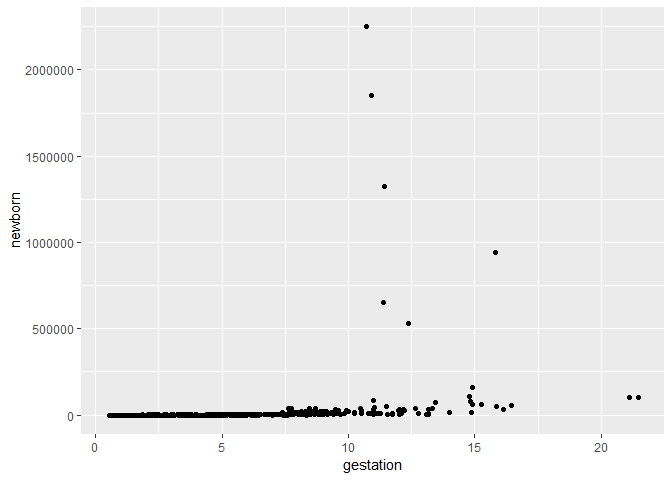
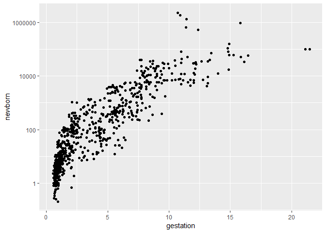
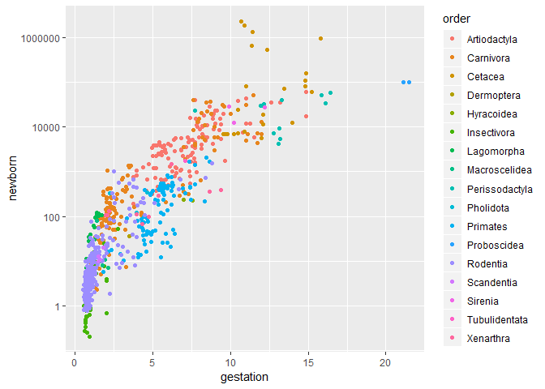
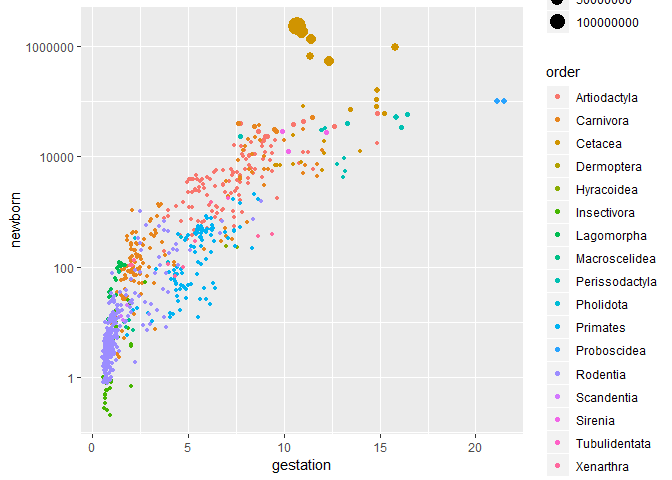
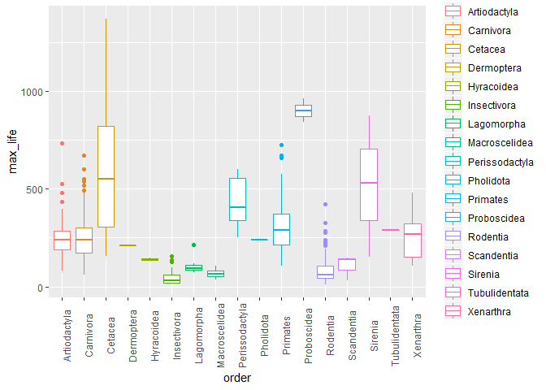

##Instructions
Answer the following questions and complete the exercises in RMarkdown. Please embed all of your code, keep track of your versions using git, and push your final work to our GitHub repository. I will randomly select a few examples of student work at the start of each session to use as examples so be sure that your code is working to the best of your ability.

Load the tidyverse


```r
library(tidyverse)
```

```
## -- Attaching packages ------------------------------------------------------------------------------------------------------------ tidyverse 1.2.1 --
```

```
## v ggplot2 3.1.0     v purrr   0.2.5
## v tibble  1.4.2     v dplyr   0.7.8
## v tidyr   0.8.2     v stringr 1.3.1
## v readr   1.3.1     v forcats 0.3.0
```

```
## -- Conflicts --------------------------------------------------------------------------------------------------------------- tidyverse_conflicts() --
## x dplyr::filter() masks stats::filter()
## x dplyr::lag()    masks stats::lag()
```


## Mammals Life History
Let’s revisit the mammal life history data to practice our ggplot skills. Some of the tidy steps will be a repeat from the homework, but it is good practice. The data are from: S. K. Morgan Ernest. 2003. Life history characteristics of placental non-volant mammals. Ecology 84:3402.

Load the data.

```r
mammals <- readr::read_csv("mammal_lifehistories_v2.csv")
```

```
## Parsed with column specification:
## cols(
##   order = col_character(),
##   family = col_character(),
##   Genus = col_character(),
##   species = col_character(),
##   mass = col_double(),
##   gestation = col_double(),
##   newborn = col_double(),
##   weaning = col_double(),
##   `wean mass` = col_double(),
##   AFR = col_double(),
##   `max. life` = col_double(),
##   `litter size` = col_double(),
##   `litters/year` = col_double()
## )
```

Use your preferred function to have a look. Do you notice any problems?


```r
head(mammals)
```

```
## # A tibble: 6 x 13
##   order family Genus species   mass gestation newborn weaning `wean mass`
##   <chr> <chr>  <chr> <chr>    <dbl>     <dbl>   <dbl>   <dbl>       <dbl>
## 1 Arti~ Antil~ Anti~ americ~  45375      8.13   3246.    3           8900
## 2 Arti~ Bovid~ Addax nasoma~ 182375      9.39   5480     6.5         -999
## 3 Arti~ Bovid~ Aepy~ melamp~  41480      6.35   5093     5.63       15900
## 4 Arti~ Bovid~ Alce~ busela~ 150000      7.9   10167.    6.5         -999
## 5 Arti~ Bovid~ Ammo~ clarkei  28500      6.8    -999  -999           -999
## 6 Arti~ Bovid~ Ammo~ lervia   55500      5.08   3810     4           -999
## # ... with 4 more variables: AFR <dbl>, `max. life` <dbl>, `litter
## #   size` <dbl>, `litters/year` <dbl>
```

```r
summary(mammals)
```

```
##     order              family             Genus          
##  Length:1440        Length:1440        Length:1440       
##  Class :character   Class :character   Class :character  
##  Mode  :character   Mode  :character   Mode  :character  
##                                                          
##                                                          
##                                                          
##    species               mass             gestation      
##  Length:1440        Min.   :     -999   Min.   :-999.00  
##  Class :character   1st Qu.:       50   1st Qu.:-999.00  
##  Mode  :character   Median :      403   Median :   1.05  
##                     Mean   :   383577   Mean   :-287.25  
##                     3rd Qu.:     7009   3rd Qu.:   4.50  
##                     Max.   :149000000   Max.   :  21.46  
##     newborn             weaning          wean mass       
##  Min.   :   -999.0   Min.   :-999.00   Min.   :    -999  
##  1st Qu.:   -999.0   1st Qu.:-999.00   1st Qu.:    -999  
##  Median :      2.6   Median :   0.73   Median :    -999  
##  Mean   :   6703.1   Mean   :-427.17   Mean   :   16049  
##  3rd Qu.:     98.0   3rd Qu.:   2.00   3rd Qu.:      10  
##  Max.   :2250000.0   Max.   :  48.00   Max.   :19075000  
##       AFR            max. life       litter size        litters/year     
##  Min.   :-999.00   Min.   :-999.0   Min.   :-999.000   Min.   :-999.000  
##  1st Qu.:-999.00   1st Qu.:-999.0   1st Qu.:   1.000   1st Qu.:-999.000  
##  Median :   2.50   Median :-999.0   Median :   2.270   Median :   0.375  
##  Mean   :-408.12   Mean   :-490.3   Mean   : -55.634   Mean   :-477.141  
##  3rd Qu.:  15.61   3rd Qu.: 147.2   3rd Qu.:   3.835   3rd Qu.:   1.155  
##  Max.   : 210.00   Max.   :1368.0   Max.   :  14.180   Max.   :   7.500
```

There are NA’s. How are you going to deal with them?

```r
#adjusts "-999" values to r-readable NAs
mammals <- na_if(mammals,"-999")
```

Where are the NA’s? This is important to keep in mind as you build plots.

_They occur in mass, gestation, newborn, weaning, wean mass, AFR, max. life, litters/year and litter size, but are concenrated in wean mass._ 


Some of the variable names will be problematic. Let’s rename them here as a final tidy step.


```r
mammals <- mammals%>%
rename(
  genus = Genus,
  wean_mass = `wean mass`,
  max_life = `max. life`,
  litter_size = `litter size`,
  litters_yr = `litters/year`
       )
```


##ggplot()
For the questions below, try to use the aesthetics you have learned to make visually appealing and informative plots. Make sure to include labels for the axes and titles.


```r
options(scipen=999) #cancels the use of scientific notation for the session
```


What is the relationship between newborn body mass and gestation? Make a scatterplot that shows this relationship.

```r
ggplot(data=mammals, mapping=aes(x=gestation, y=newborn)) +
  geom_point()
```

```
## Warning: Removed 673 rows containing missing values (geom_point).
```

<!-- -->


You should notice that because of the outliers in newborn mass, we need to make some changes. We didn’t talk about this in lab, but you can use scale_x_log10() as a layer to correct for this issue. This will log transform the y-axis values.


```r
ggplot(data=mammals, mapping=aes(x=gestation, y=newborn)) +
  geom_point()+
  scale_y_log10()
```

```
## Warning: Removed 673 rows containing missing values (geom_point).
```

<!-- -->

Now that you have the basic plot, color the points by taxonomic order.

```r
ggplot(data=mammals, mapping=aes(x=gestation, y=newborn, color = order)) +
  geom_point()+
  scale_y_log10()
```

```
## Warning: Removed 673 rows containing missing values (geom_point).
```

<!-- -->


Lastly, make the size of the points proportional to body mass.

```r
ggplot(data=mammals, mapping=aes(x=gestation, y=newborn, color = order, size = mass)) +
  geom_point()+
  scale_y_log10()
```

```
## Warning: Removed 691 rows containing missing values (geom_point).
```

<!-- -->

Make a plot that shows the range of lifespan by order.


```r
#check there is an appropriate number for boxplots
mammals %>%
  group_by(order) %>%
  summarize(count=n())
```

```
## # A tibble: 17 x 2
##    order          count
##    <chr>          <int>
##  1 Artiodactyla     161
##  2 Carnivora        197
##  3 Cetacea           55
##  4 Dermoptera         2
##  5 Hyracoidea         4
##  6 Insectivora       91
##  7 Lagomorpha        42
##  8 Macroscelidea     10
##  9 Perissodactyla    15
## 10 Pholidota          7
## 11 Primates         156
## 12 Proboscidea        2
## 13 Rodentia         665
## 14 Scandentia         7
## 15 Sirenia            5
## 16 Tubulidentata      1
## 17 Xenarthra         20
```


```r
ggplot(data=mammals, mapping=aes(x=order, y=max_life, color = order)) +
  geom_boxplot()+
  theme(axis.text.x = element_text(angle = 90))
```

```
## Warning: Removed 841 rows containing non-finite values (stat_boxplot).
```

<!-- -->


Push your final code to GitHub
Make sure that you push your code into the appropriate folder. Also, be sure that you have check the keep md file in the knit preferences.
