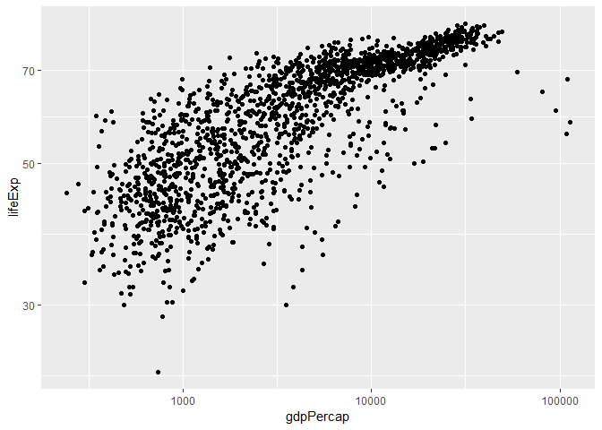
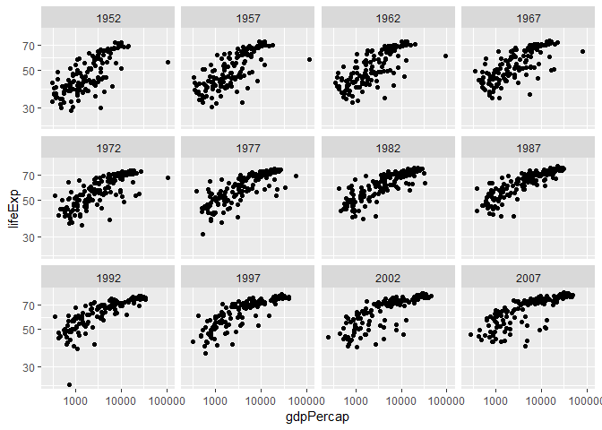
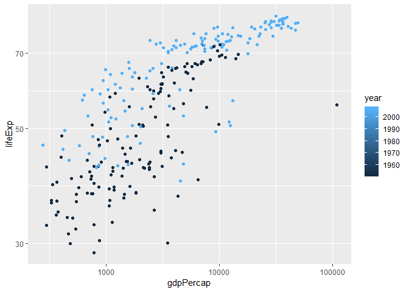
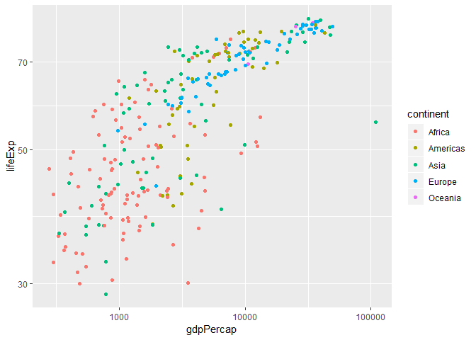
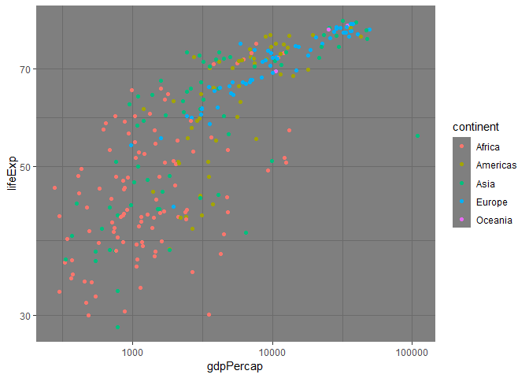
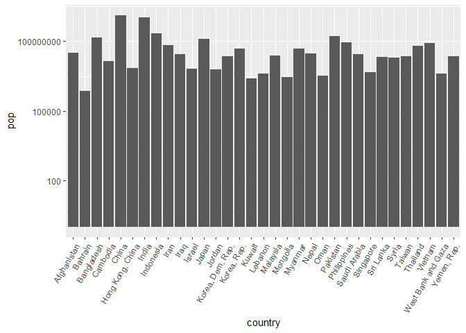
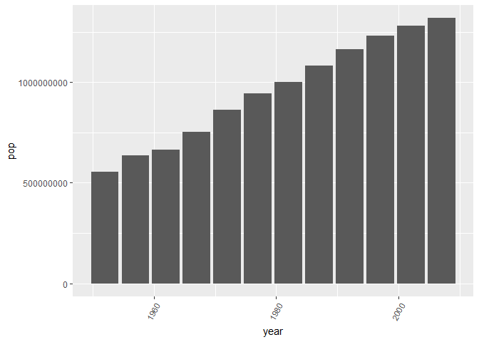
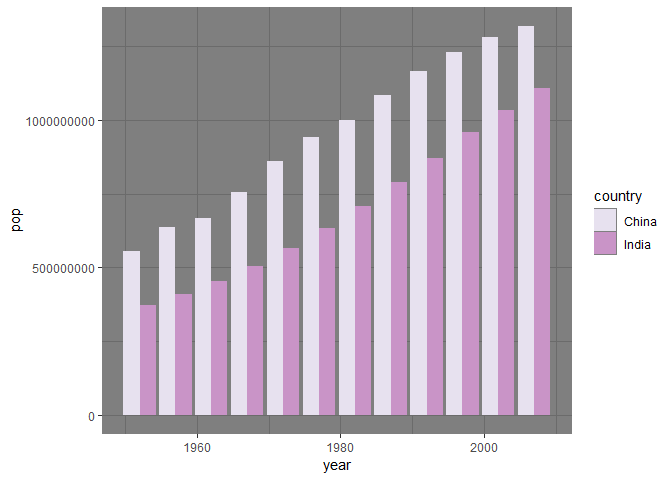

## Load the libraries

```r
library(tidyverse)
library(skimr)
library(RColorBrewer)
options(scipen = 999)
#library(devtools)
```

## Resources
The idea for this assignment came from [Rebecca Barter's](http://www.rebeccabarter.com/blog/2017-11-17-ggplot2_tutorial/) ggplot tutorial so if you get lost go have a look. Please do not copy and paste her code!  

## Gapminder
For this assignment, we are going to use the dataset [gapminder](https://cran.r-project.org/web/packages/gapminder/index.html). Gapminder includes information about economics, population, and life expectancy from countries all over the world. You will need to install it before use.

```r
#install.packages("gapminder")
#install.packages("devtools")

devtools::install_github("cttobin/ggthemr")
```

```
## Skipping install of 'ggthemr' from a github remote, the SHA1 (10eb50a7) has not changed since last install.
##   Use `force = TRUE` to force installation
```


```r
library("gapminder")
```

Please load the data into a new object called gapminder.

```r
gapminder <- 
  gapminder::gapminder
```

1. Explore the data using the various function you have learned. Is it tidy, are there any NA's, what are its dimensions, what are the column names, etc.


```r
summary(gapminder)
```

```
##         country        continent        year         lifeExp     
##  Afghanistan:  12   Africa  :624   Min.   :1952   Min.   :23.60  
##  Albania    :  12   Americas:300   1st Qu.:1966   1st Qu.:48.20  
##  Algeria    :  12   Asia    :396   Median :1980   Median :60.71  
##  Angola     :  12   Europe  :360   Mean   :1980   Mean   :59.47  
##  Argentina  :  12   Oceania : 24   3rd Qu.:1993   3rd Qu.:70.85  
##  Australia  :  12                  Max.   :2007   Max.   :82.60  
##  (Other)    :1632                                                
##       pop               gdpPercap       
##  Min.   :     60011   Min.   :   241.2  
##  1st Qu.:   2793664   1st Qu.:  1202.1  
##  Median :   7023596   Median :  3531.8  
##  Mean   :  29601212   Mean   :  7215.3  
##  3rd Qu.:  19585222   3rd Qu.:  9325.5  
##  Max.   :1318683096   Max.   :113523.1  
## 
```


```r
head(gapminder)
```

```
## # A tibble: 6 x 6
##   country     continent  year lifeExp      pop gdpPercap
##   <fct>       <fct>     <int>   <dbl>    <int>     <dbl>
## 1 Afghanistan Asia       1952    28.8  8425333      779.
## 2 Afghanistan Asia       1957    30.3  9240934      821.
## 3 Afghanistan Asia       1962    32.0 10267083      853.
## 4 Afghanistan Asia       1967    34.0 11537966      836.
## 5 Afghanistan Asia       1972    36.1 13079460      740.
## 6 Afghanistan Asia       1977    38.4 14880372      786.
```


_The data look tidy. Each column has one type of data, and all data are stored in columns. There dont appear to be any NAs in the data. There are 6 variables and there are 1704 observations_


2. We are interested in the relationship between per capita GDP and life expectancy; i.e. does having more money help you live longer on average. Make a quick plot below to visualize this relationship.

```r
gapminder %>%
ggplot(aes(x = gdpPercap, y = lifeExp))+
    geom_point()
```

<!-- -->


3. There is extreme disparity in per capita GDP. Rescale the x axis to make this easier to interpret. How would you characterize the relationship?


```r
gapminder %>%
ggplot(aes(x = gdpPercap, y = lifeExp))+
    geom_point()+
    scale_y_log10()+
    scale_x_log10()
```

<!-- -->

4. This should look pretty dense to you with significant overplotting. Try using a faceting approach to break this relationship down by year.


```r
gapminder %>%
ggplot(aes(x = gdpPercap, y = lifeExp))+
    geom_point()+
    scale_y_log10()+
    scale_x_log10()+
    facet_wrap(~year)
```

<!-- -->

5. Simplify the comparison by comparing only 1952 and 2007. Can you come to any conclusions?


```r
gapminder %>%
    filter(year == 2007 | year == 1952)%>%
ggplot(aes(x = gdpPercap, y = lifeExp, color = year))+
    geom_point()+
    scale_y_log10()+
    scale_x_log10()
```

<!-- -->

6. Let's stick with the 1952 and 2007 comparison but make some aesthetic adjustments. First try to color by continent and adjust the size of the points by population. Add `+ scale_size(range = c(0.1, 10), guide = "none")` as a layer to clean things up a bit.


```r
gapminder %>%
    filter(year == 2007 | year == 1952)%>%
ggplot(aes(x = gdpPercap, y = lifeExp, color = continent))+
    geom_point()+
    scale_y_log10()+
    scale_x_log10()+
    scale_size(range = c(0.1, 10), guide = "none")
```

<!-- -->

7. Although we did not introduce them in lab, ggplot has a number of built-in themes that make things easier. I like the light theme for these data, but you can see lots of options. Apply one of these to your plot above.

```r
?theme_void
```

```
## starting httpd help server ... done
```

```r
gapminder %>%
    filter(year == 2007 | year == 1952)%>%
ggplot(aes(x = gdpPercap, y = lifeExp, color = continent))+
    geom_point()+
    scale_y_log10()+
    scale_x_log10()+
    scale_size(range = c(0.1, 10), guide = "none")+
    theme_dark()
```

<!-- -->


8. What is the population for all countries on the Asian continent in 2007? Show this as a barplot.


```r
gapminder %>%
    filter(continent == "Asia") %>%
    filter(year == 2007) %>%
    ggplot(aes(x = country, y = pop))+
    geom_col()+
    theme(axis.text.x = element_text(angle = 60, hjust=1))+                     scale_y_log10()
```

<!-- -->

9. You should see that China's population is the largest with India a close second. Let's focus on China only. Make a plot that shows how population has changed over the years.


```r
gapminder %>%
    filter(country == "China") %>%
    ggplot(aes(x = year, y = pop))+
    geom_col()+
    theme(axis.text.x = element_text(angle = 60, hjust=1))
```

<!-- -->

10. Let's compare China and India. Make a barplot that shows population growth by year using `position=dodge`. Apply a custom color theme using RColorBrewer.


```r
display.brewer.all()
```

<!-- -->


```r
gapminder %>%
    filter(country == "China" | country == "India") %>%
    ggplot(aes(x = year, y = pop, fill = country))+
    geom_bar(position = "dodge", stat = "identity")+
    theme(axis.text.x = element_text(angle = 60, hjust=1))+
    theme_dark()+
    scale_fill_brewer(palette="PuRd")
```

<!-- -->


## Push your final code to [GitHub](https://github.com/FRS417-DataScienceBiologists)
Make sure that you push your code into the appropriate folder. Also, be sure that you have check the `keep md` file in the knit preferences.
